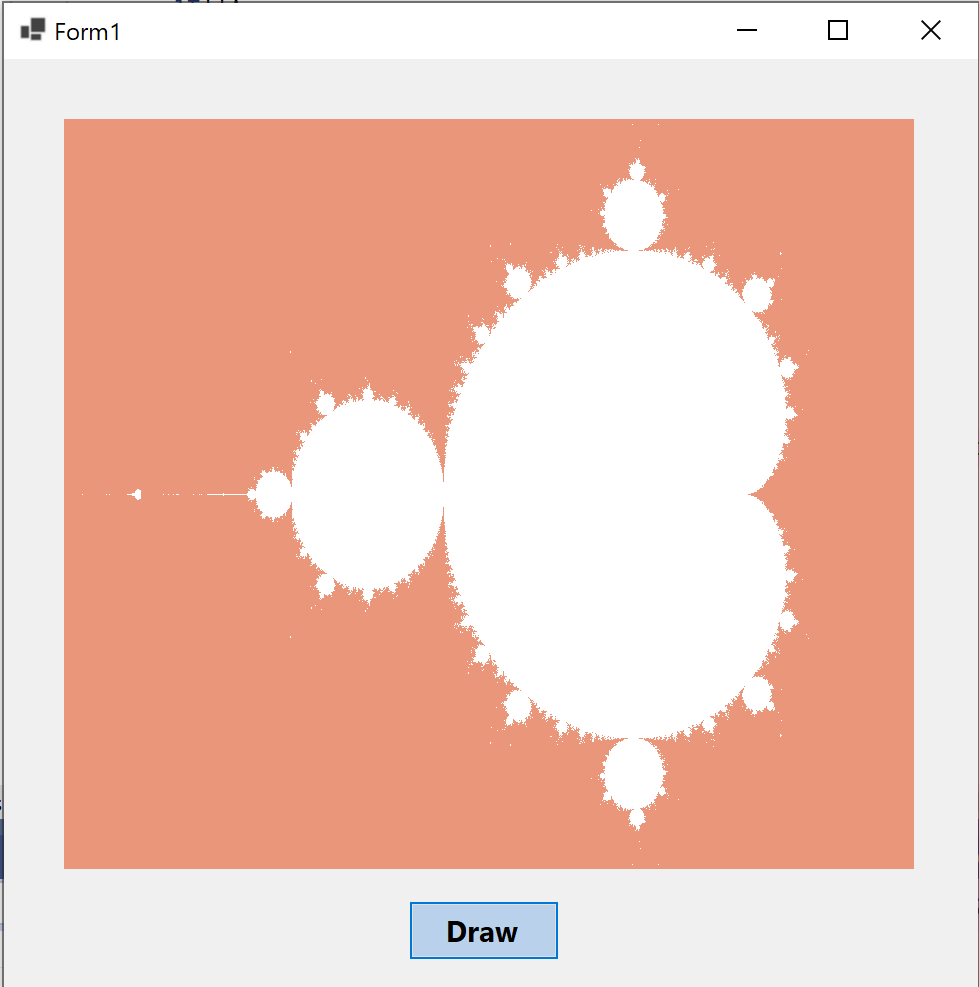

# Mandelbrot
A C# Forms App to draw Mandelbrot set.

## Technologies used in this project:

 

## Info:
The mandelbrot set is one of the most famous fractal, and it's very easy to draw. The mandelbrot set is defined by the set of complex numbers **c** for which the complex numbers of the sequence **Zn** remain bounded in absolute value. The sequence **Zn** is defined by: **Z0=0** & **Zn+1=Zn^2+c**

The project should be opened in **Microsoft Visual Studio**. Simply compile the project and run it. You will be presented with an interface.

Click on Draw and the fractal will be drawn.

  

## Note

Feel free to download the project and build upon it. Happy coding!
